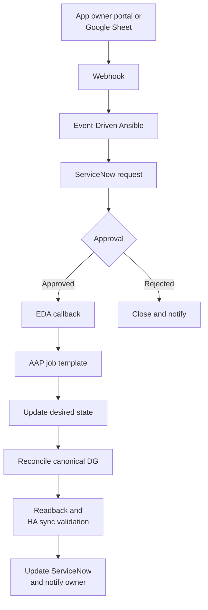

# Roadmap: Trusted-Source Governance

```
# --------------------------------------------------------------------------
# NOTES:    ROADMAP.md
# --------------------------------------------------------------------------
# ABSTRACT: Phased path from the v0.3.8 full-rule trusted-source POC to an
#     application-owner self-service workflow with approval and reconciliation.
# CREATED:  260730 BY: JN
# UPDATED:  260731 BY: Sol(GPT5.6)::Copilot:MAC-00
# VERSION:  0.3.8
# ARCHITECT: JN
# TECHLEAD: JN
# --------------------------------------------------------------------------
```

## Phase 0: Incident Stabilization

- Raise the QA rate ceiling while monitor behavior is characterized.
- Prevent block lookups from renewing idle timeouts.
- Prove trusted-source host/CIDR matching and ISA-visible bypass events.
- Correct stale runbook claims that generic iRule table state is exposed through tmsh.

## Phase 1: Canonical DG POC

- Deploy `/Common/dg_swagwaf_trusted_sources` as an internal `type ip` data group.
- Validate the full `/Common/ADMIN-SwagWAF` rule on BIG-IP 17.5.
- Store owner, service, ticket, and expiry metadata in record values.
- Confirm DG readback, event metadata, negative tests, and HA config sync.
- Keep `/Common/Admin-SwagWAF_lite` unchanged during the POC.

## Phase 2: Rule-Variant Convergence

- Identify the owner and purpose of every SwagWAF variant.
- Make each supported variant consume the same canonical DG.
- Deprecate variants that cannot meet the common logging and policy contract.
- Remove per-rule exception mechanisms after convergence.

## Phase 3: Governed Automation

- Store desired trusted-source state in Git or an authoritative ServiceNow table.
- Add validation for canonical CIDRs, overlap, ownership, expiration, and environment.
- Use AAP to render and reconcile the complete DG through iControl REST or supported F5 modules.
- Verify deployment, readback, HA sync, and Sumo visibility.
- Retain tmsh record mutation as a reviewed break-glass path.

## Phase 4: Application-Owner Intake



- The intake surface is not authoritative state.
- Approved jobs retrieve policy fields from ServiceNow by `sys_id`; callbacks do not
  carry trusted policy values directly.
- Production additions, expansions, and cross-owner deletions require approval.

## Phase 5: Lifecycle Governance

- Require expiration for temporary entries.
- Reconcile expired records on a schedule and update the associated ticket.
- Alert on missing owners, stale tickets, broad CIDRs, overlaps, and drift.
- Publish audit views from ServiceNow, Git history, AAP job events, and ISA logs.

## Phase 6: Observable Event Contract

- Define one backward-compatible field envelope for every `SWAGWAF|EVENT` record.
- Emit `policy`, `reason`, and `threat` on every event, using explicit neutral values
  such as `N/A` when a field does not apply.
- Preserve stable `src`, `dst`, `vip`, `method`, `uri`, and event-name semantics across
  the full and supported lite variants.
- Publish SIEM parsing examples that aggregate by hour, iRule, event, source, policy,
  reason, and threat without event-specific fallback expressions.
- Add schema assertions to post-deploy tests before changing the production log contract.
