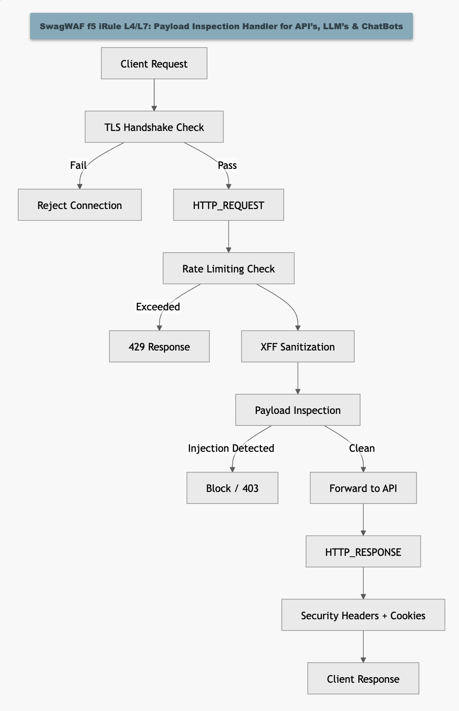

# 🏆 SwagWAF — AI-Aware WAF for LLM APIs

> **AppWorld 2026 Winner — Budget Bodyguard Award**
> Lightweight. AI-Aware. Production-Ready.

---

## 🚀 Overview
SwagWAF is a production-ready F5 iRule that protects AI/LLM APIs from:
- Bot abuse draining token-based billing
- Prompt injection attacks
- Rapid-fire inference abuse
- Insecure integrations leaking sensitive data

---

## 🧠 Architecture

---

## ⚙️ Features
- Sliding window rate limiting (per IP / extensible per endpoint)
- Prompt injection detection (AI-specific patterns)
- TLS enforcement (1.2+)
- Security header & cookie hardening
- Dynamic data group support (adaptive threat intelligence)

---

## 🔄 Adaptive Threat Intelligence
Explain your data-group model here (this is your differentiator)

---

## 🧪 Testing
(paste your curl examples)

---

## 📈 Impact
- $0 licensing vs enterprise WAF
- <5 min deployment
- Drop-in protection (no code changes)

---

## 🏆 Recognition
SwagWAF was awarded the **“Budget Bodyguard Award”** at AppWorld 2026 (Las Vegas)  
for delivering high-impact API security with minimal cost and operational overhead.

---

## 📌 Roadmap
- [ ] Endpoint-specific rate limiting via data groups
- [ ] External threat feed integration
- [ ] IP reputation enrichment
